# Talker — Architecture Document

**Last updated:** 2026-03-11
**Status:** All phases (1-4) complete

## What Is Talker?

A psychology pre-assessment voice assistant. Users take validated DSM-5 screening questionnaires via voice or text, followed by a conversational follow-up, to understand their symptoms and know where to seek professional help.

**It is NOT a medical tool.** It is a guide.

---

## High-Level Architecture

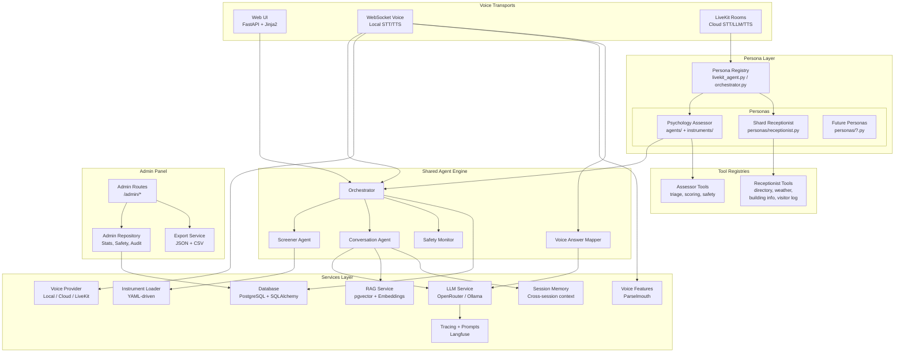

**Why this architecture?**
The hybrid screening model (rigid questionnaires + open conversation) maps naturally to specialized agents. The Orchestrator decides when to use structured screeners vs free-form dialogue. Adding a new screening instrument = adding a YAML file, not writing code. Adding a new persona = adding a tool file + registering the agent class.

---

## Persona System — How Different Agents Share One Platform

> **For AI tools:** This section explains the persona abstraction. When adding new personas, follow this pattern exactly.

The platform supports multiple personas — different conversational agents with different tools, instructions, and purposes — running on the same engine. Each persona is a configuration, not a codebase.

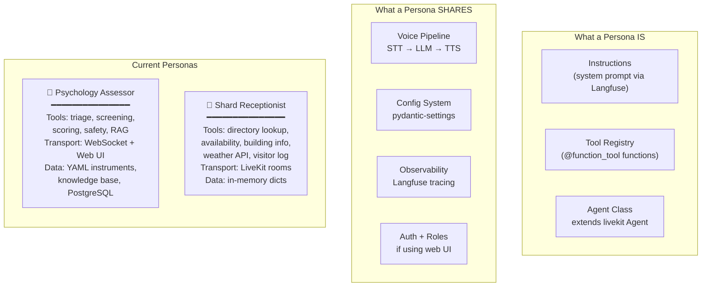

### Persona comparison — same pattern, different purpose

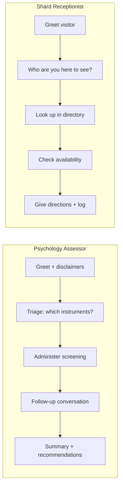

Both follow the same pattern: **greet → understand need → use tools → respond naturally → close.**

### Adding a new persona

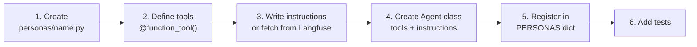

No schema changes. No route changes. No database migrations. Just a Python file with tools and a prompt.

### Capabilities — pluggable pipeline modules

> **For AI tools:** Capabilities and tools are different things. Tools are called by the LLM on demand. Capabilities run automatically on every audio turn and inject context into the LLM before it responds.

Capabilities are processing modules that hook into the voice pipeline. They analyze audio, enrich context, and optionally expose tools. Any persona can opt into any capability.

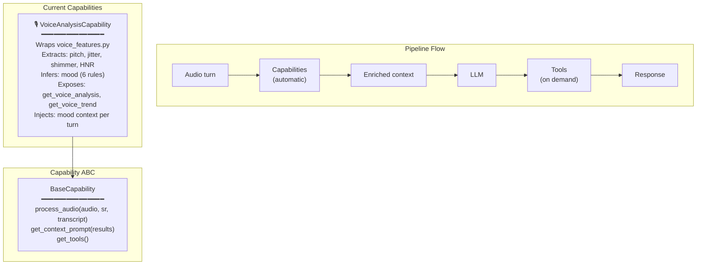

**Adding a capability to a persona:**

```python
PERSONAS = {
    "receptionist": {
        "agent_class": ReceptionistAgent,
        "capabilities": [VoiceAnalysisCapability],  # plug in
    },
    "receptionist-basic": {
        "agent_class": ReceptionistAgent,
        "capabilities": [],  # opt out
    },
}
```

See [`docs/livekit-architecture.md`](livekit-architecture.md) for the detailed capability architecture with mood inference rules and audio processing pipeline.

---

## Session State Machine

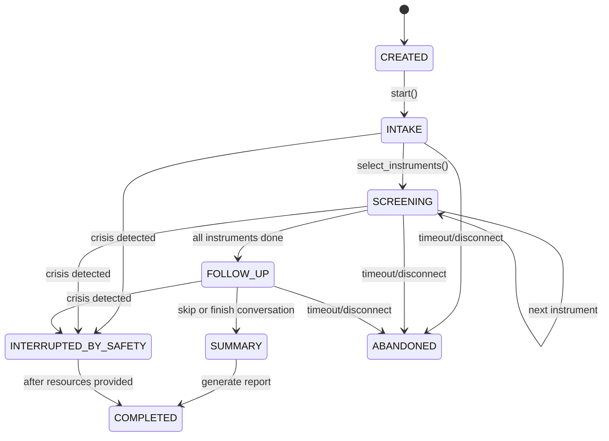

**Why a state machine?**
Assessment flow is linear and auditable. Each state has clear entry/exit conditions. Sessions can be persisted mid-flow and resumed. The state is the single source of truth for "where are we."

---

## Agent Layer — How They Work Together

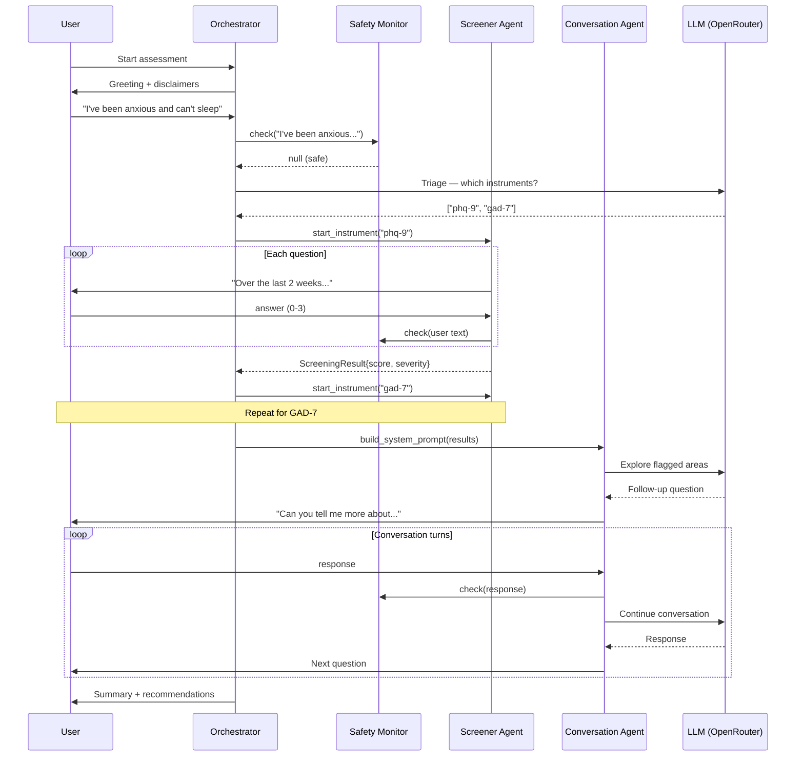

**Why separate agents instead of one monolith?**
- **Screener** asks questions *exactly as validated* — no LLM rephrasing allowed (clinical validity)
- **Conversation** is LLM-powered and exploratory — completely different behavior
- **Safety Monitor** watches everything in parallel — can interrupt any agent at any point
- Each agent is independently testable

---

## Data Flow — Screening Instruments

```mermaid
flowchart LR
    YAML["YAML Definition<br/>phq-9.yaml"] --> LOADER["InstrumentLoader<br/>load() / load_all()"]
    LOADER --> DEF["InstrumentDefinition<br/>questions, options, scoring"]
    DEF --> SCREENER["ScreenerAgent<br/>question-by-question"]
    SCREENER --> ANSWERS["Raw Answers<br/>{q1: 2, q2: 1, ...}"]
    ANSWERS --> SCORE["score() method<br/>sum / custom"]
    SCORE --> RESULT["ScreeningResult<br/>score, severity, flags"]
    RESULT --> ORCH["Orchestrator<br/>completed_results[]"]
```

**Why YAML-driven instruments?**
- Adding PHQ-9, GAD-7, PCL-5, ASRS required zero Python code per instrument
- Each YAML defines: questions, response options, scoring method, severity thresholds, flag rules
- Supports multiple scoring methods (`sum`, `asrs_screener` with per-item thresholds)
- Clinicians can review/edit instruments without touching code

---

## Project Structure

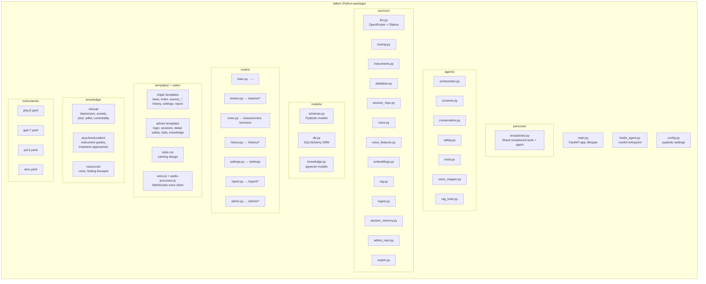

---

## Technology Choices — Why Each One

| Technology | Role | Why chosen |
|---|---|---|
| **FastAPI** | Web framework | Async-native, Pydantic-first, great for both REST APIs and SSR with Jinja2 |
| **Jinja2 (SSR)** | Templating | Server-side rendered = simple, no JS framework complexity. Works offline. Mental health tool should feel calm, not "app-like" |
| **PydanticAI** | Agent framework | Type-safe agents with `deps_type`/`output_type`, built-in tool calling, works with any OpenAI-compatible provider |
| **OpenRouter** | LLM provider (cloud) | Access to Claude, GPT, Llama etc via single API. Easy model switching for conversation vs screener (different cost/quality tradeoffs) |
| **Ollama** | LLM provider (local) | Local LLM fallback when no API key configured. Uses OpenAI-compatible endpoint |
| **Langfuse** | LLM tracing | Trace every LLM call for quality auditing. Critical for a health-adjacent tool — need to verify conversation quality |
| **PostgreSQL + pgvector** | Storage + embeddings | JSONB for flexible schema. pgvector for RAG semantic search with cosine distance |
| **Chart.js** | Admin visualizations | Lightweight charting (CDN) for voice features and stats dashboards |
| **SQLAlchemy 2.0 async** | ORM | Async support, mapped columns, works well with FastAPI's async lifecycle |
| **pydantic-settings** | Configuration | Type-safe `.env` loading, validation, defaults. No stringly-typed config |
| **YAML instruments** | Screening definitions | Human-readable, clinician-editable, data-driven. No code per instrument |
| **faster-whisper** | Local STT | Fast CPU inference (int8), lazy-loaded, multiple model sizes |
| **Piper TTS** | Local TTS | Lightweight neural TTS, streaming PCM output, multiple voices |
| **Deepgram** | Cloud STT | High-accuracy speech recognition, Nova-2 model |
| **ElevenLabs** | Cloud TTS | Natural-sounding voices, streaming PCM output |
| **Parselmouth** | Voice analysis | Praat wrapper for pitch (F0), jitter, shimmer, HNR extraction |
| **LiveKit Agents** | Real-time voice transport | Room-based communication, managed STT/LLM/TTS pipeline, persona-driven agents via `@function_tool` |
| **WeasyPrint** | PDF reports | HTML-to-PDF with CSS support, standalone report templates |

---

## What Is Implemented (Phase 1 MVP)

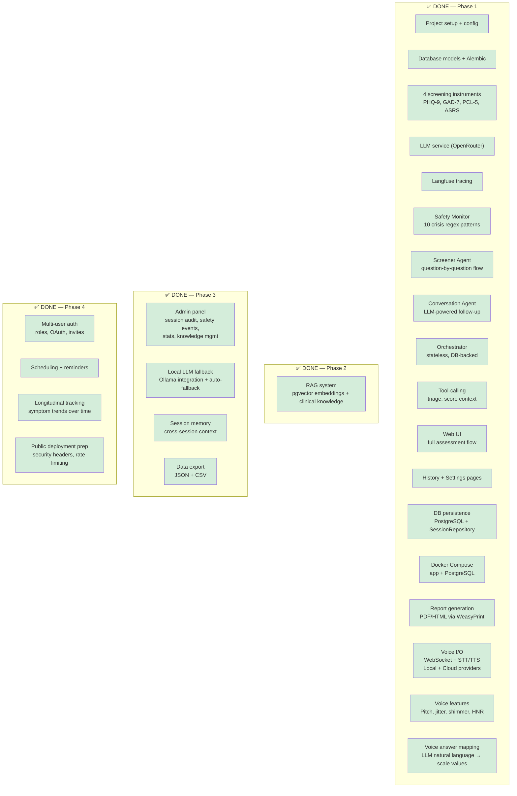

### What works today (Phases 1-4)

| Component | Status | Tests | Notes |
|---|---|---|---|
| Config (pydantic-settings) | ✅ | — | `.env` loading, all keys with defaults |
| Pydantic schemas | ✅ | 4 | SessionState, ScreeningResult, etc |
| SQLAlchemy ORM | ✅ | — | User, Session, Screening, Conversation, SafetyEvent, Knowledge tables |
| Alembic migrations | ✅ | — | 3 migrations (initial, knowledge tables, admin_notes) |
| Instrument loader | ✅ | 5 | YAML parsing, scoring (sum + asrs_screener), flag rules |
| PHQ-9, GAD-7, PCL-5, ASRS | ✅ | — | Complete YAML definitions |
| LLM service | ✅ | 6 | OpenRouter + Ollama fallback via PydanticAI |
| Langfuse tracing | ✅ | — | Init, trace creation (no-op when unconfigured) |
| Safety Monitor | ✅ | 6 | 10 crisis patterns, case-insensitive, 4 resource links |
| Screener Agent | ✅ | 5 | Question-by-question, scoring, progress tracking |
| Conversation Agent | ✅ | 3 | System prompt builder with screening + RAG + memory context |
| Orchestrator | ✅ | 7 | Stateless, DB-backed, replays answers to restore position |
| Agent tools | ✅ | 7 | parse_instrument_selection, get_score_context, build_clinical_query |
| SessionRepository | ✅ | 10 | Full async CRUD: create, load, save answers/screenings/messages/summary |
| RAG system | ✅ | 15 | Markdown chunking, embeddings (OpenAI/Ollama), pgvector search |
| Session memory | ✅ | 2 | Cross-session context injection into prompts |
| Admin panel | ✅ | 5 | Session audit, safety dashboard, stats, knowledge mgmt |
| Data export | ✅ | 2 | JSON + CSV export from admin panel |
| Web UI (home) | ✅ | — | Calming design, SSR |
| Web UI (assessment) | ✅ | — | Instrument selection → screening → conversation → summary |
| Web UI (history) | ✅ | — | DB-backed session list + detail views |
| Web UI (settings) | ✅ | — | Service status, LLM provider, RAG, voice config |
| Docker Compose | ✅ | — | App + PostgreSQL, auto-migrations on startup |
| Report generation | ✅ | 8 | PDF/HTML via WeasyPrint, download from summary + history |
| Voice providers | ✅ | 6 | Local (faster-whisper + Piper) and cloud (Deepgram + ElevenLabs) |
| Voice features | ✅ | 6 | Pitch, jitter, shimmer, HNR, intensity, speech rate via Parselmouth |
| Voice answer mapper | ✅ | 4 | LLM-powered natural language → screening scale value mapping |
| Voice WebSocket | ✅ | — | Full voice assessment flow (screening + conversation) |
| Voice UI | ✅ | — | Dedicated voice page with mic capture, transcript, TTS playback |
| Clinical knowledge base | ✅ | — | 12 markdown docs (clinical, psychoeducation, resources) |
| Multi-user auth | ✅ | 10 | Roles (admin/clinician/patient), OAuth (Google/Apple), invites, rate limiting |
| Scheduling | ✅ | 2 | Recurrence (weekly/biweekly/monthly), due tracking |
| Longitudinal trends | ✅ | 1 | Score history, trend direction, Chart.js visualization |
| Deployment prep | ✅ | 3 | Security headers, health endpoint, trusted hosts |
| LiveKit agent | ✅ | — | Persona-driven entrypoint, STT/LLM/TTS pipeline, CLI |
| Receptionist persona | ✅ | 25 | 5 tools, fuzzy matching, directory, weather API |
| Capabilities system | ✅ | 21 | Voice analysis, mood inference (6 rules), trend tracking |
| **Total tests** | | **165** | All passing, ruff clean |

### Known limitations

- **Voice answer mapping falls back to low confidence** when no LLM provider is available
- **pgvector required** for RAG/knowledge features (gracefully skipped when unavailable)

---

## Web UI — Assessment Flow

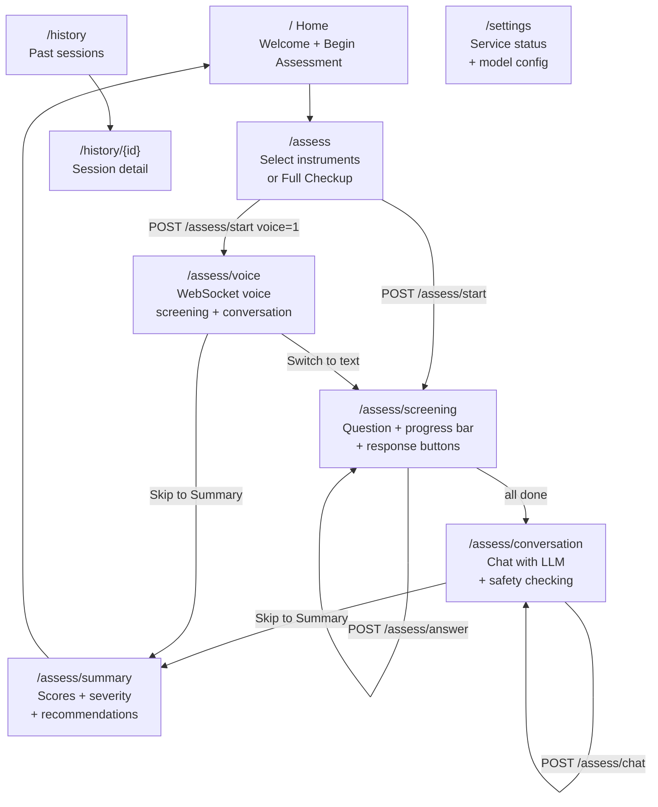

---

## Safety System

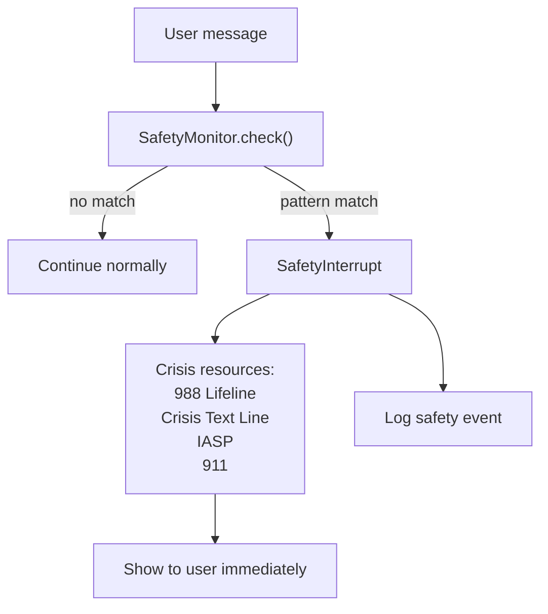

**10 regex patterns** covering:
- Suicidal ideation ("kill myself", "end my life", "want to die", etc.)
- Self-harm ("cutting myself", "self-harm")
- Harm to others ("want to hurt someone")
- Planning language ("plan to kill/die")

All case-insensitive. The Safety Monitor runs on **every** user message in every state.

**Why regex instead of LLM?**
- Zero latency — critical for safety
- Zero cost — no API calls
- Deterministic — same input always triggers same response
- Works offline — no dependency on external services
- LLM-based safety detection planned as an additional layer in Phase 2

---

## Dependency Graph

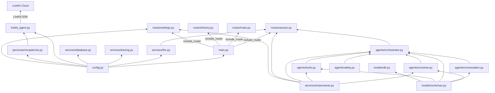

---

## Voice Transport Comparison

> **For AI tools:** The platform supports three voice transport modes. Each persona can use any transport, but in practice the assessor uses WebSocket and the receptionist uses LiveKit.

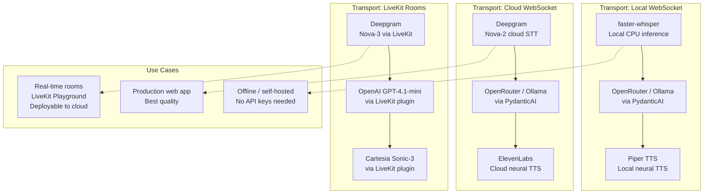

---

## Screening Instruments — Current Coverage

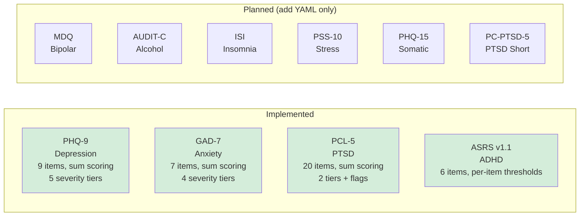

---

## Phase 2-4 Roadmap

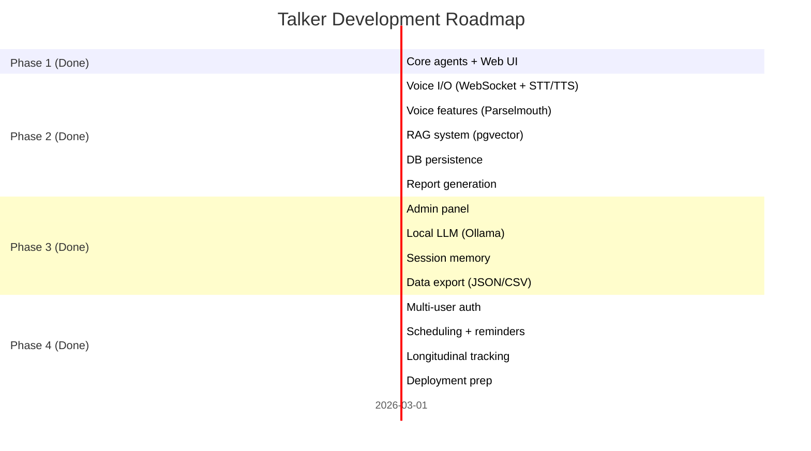

---

## Key Design Decisions — Why This Way

### 1. Agent architecture over pipeline or state machine
The hybrid nature of Talker (structured screening → open conversation) requires different behaviors at different times. An orchestrator + specialized agents handles this naturally. A pipeline would struggle with the transition from rigid questionnaires to free-form dialogue. A pure state machine would be too rigid for the conversation phase.

### 2. YAML-driven instruments over code
Clinical screening instruments are standardized — the questions, response options, and scoring are all defined by medical literature. Encoding this as data (YAML) means: no per-instrument code, easy to add new instruments, clinicians can review definitions directly, and the scoring engine is generic and well-tested.

### 3. SSR (Jinja2) over SPA (React/Vue)
For a mental health tool, the UI should feel calm and simple. Server-side rendering means: no JavaScript framework complexity, faster initial loads, works with poor connections, and the UI is a thin layer over the agent logic. If the tool grows to need real-time voice visualization, that's a targeted JS addition, not a full SPA rewrite.

### 4. Safety via regex first, LLM second
Safety detection must be: instant (no API latency), deterministic (same words always trigger), and free (no cost per check). Regex handles the obvious patterns. LLM-based nuanced detection (e.g., "I don't see the point anymore") will be added as an additional layer that enhances, not replaces, the regex baseline.

### 5. OpenRouter over direct API
Single integration point for multiple model providers. Can switch between Claude (quality), GPT (speed), or open models (cost) via config change. The screener uses a cheaper/faster model (Haiku) while conversation uses a more capable one (Sonnet) — different quality needs, same interface.

### 6. Stateless Orchestrator with DB persistence
The Orchestrator holds no mutable state — it loads SessionData from PostgreSQL per request and replays screener answers to restore position. This makes the app fully stateless and horizontally scalable. UUID session IDs prevent enumeration. JSONB columns store flexible data (instrument queues, raw answers) without schema migrations for every field change.

### 7. Pydantic everywhere
`pydantic-settings` for config, Pydantic `BaseModel` for all schemas, PydanticAI for agents, SQLAlchemy with mapped columns. One validation/serialization framework across the entire stack. No data crossing boundaries without type checking.
