# LiveKit Receptionist — Architecture Guide

> **For AI tools:** This document is the authoritative reference for the LiveKit receptionist persona. When modifying any file under `talker/personas/` or `talker/livekit_agent.py`, read this document first. All diagrams use Mermaid syntax.

**Last updated:** 2026-03-11

---

## System Overview

How the receptionist fits into the LiveKit ecosystem — from the visitor's microphone to the agent's response.

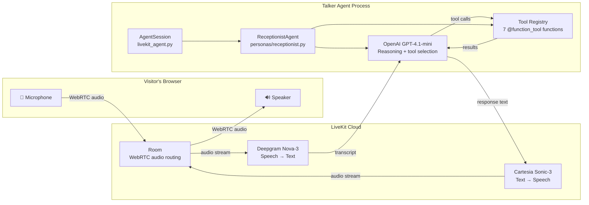

---

## Voice Pipeline — What Happens Per Turn

Every time the visitor speaks, this sequence fires:

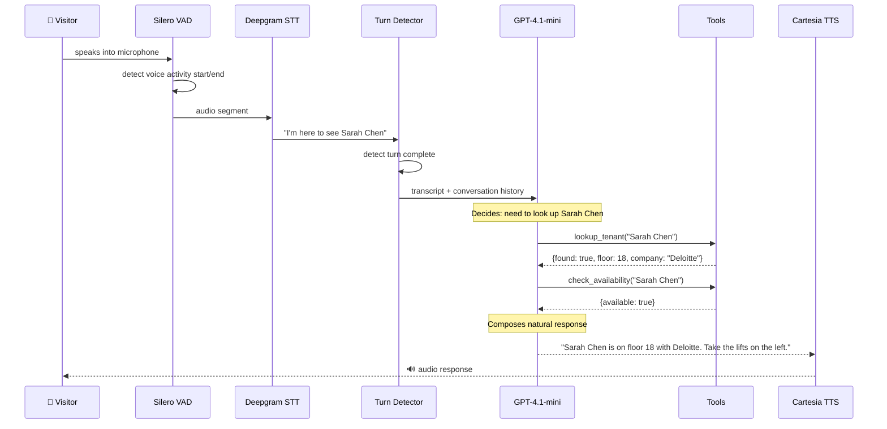

---

## Agent Architecture — Class Hierarchy

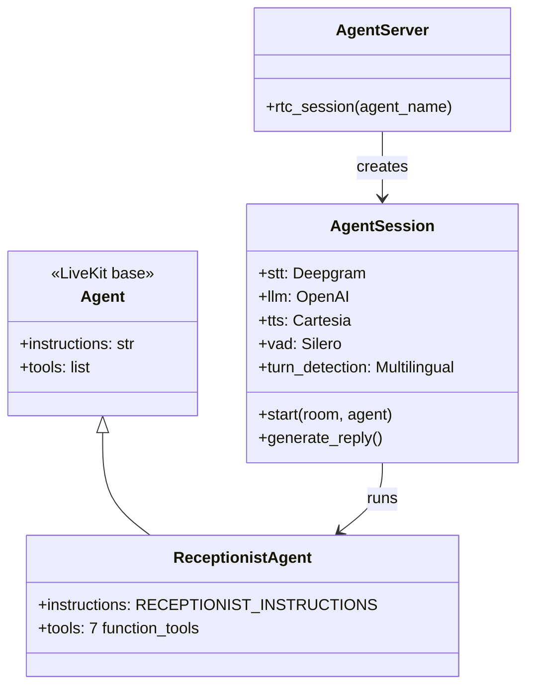

---

## Tool Registry — What the Agent Can Do

Each tool is a standalone async function decorated with `@function_tool()`. The LLM decides when to call them based on conversation context.

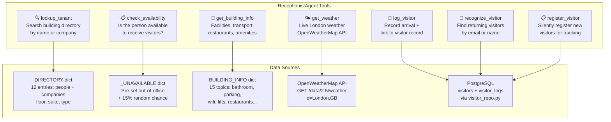

---

## Tool Decision Flow — How the LLM Picks Tools

This is the mental model the LLM follows (encoded in the system prompt):

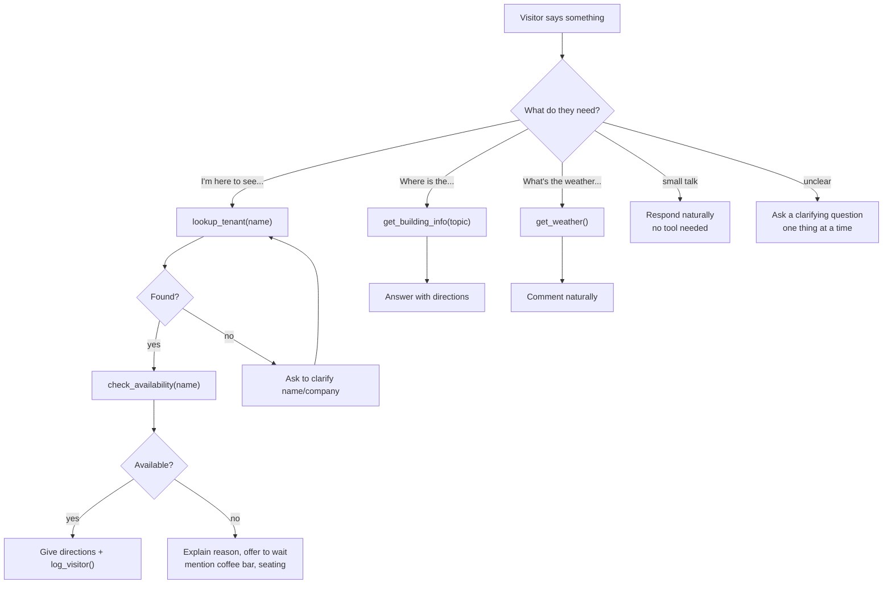

---

## Directory Data Model

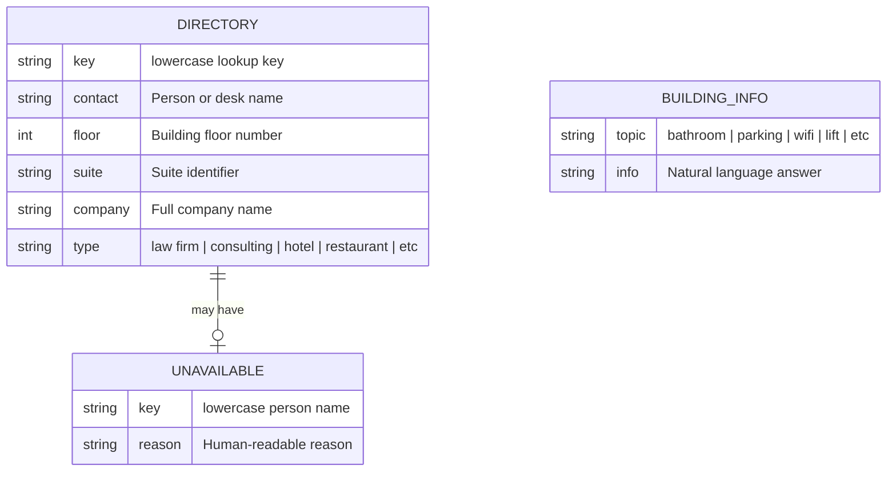

### Current tenants (12 entries, 8 unique companies)

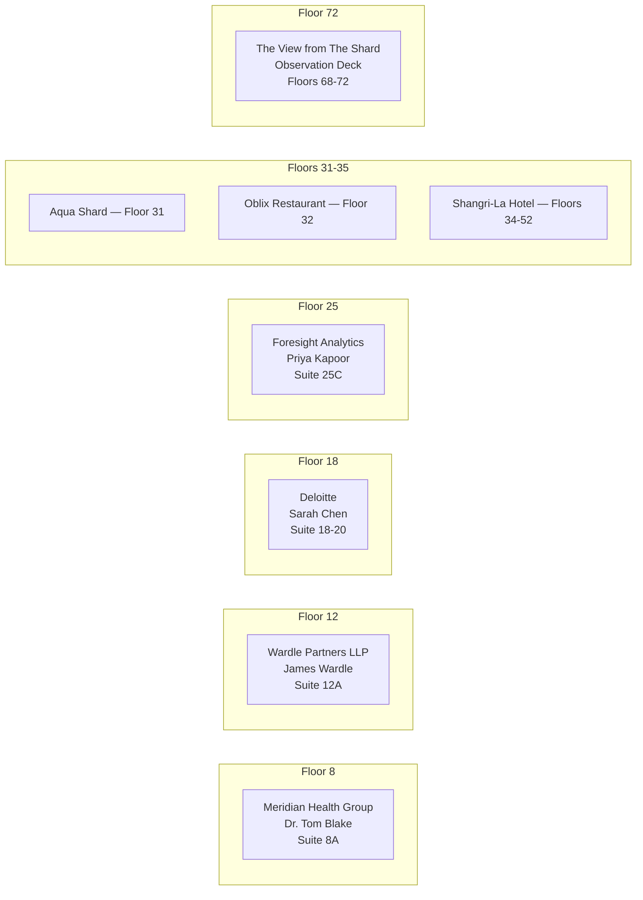

---

## Fuzzy Matching — How Names Are Resolved

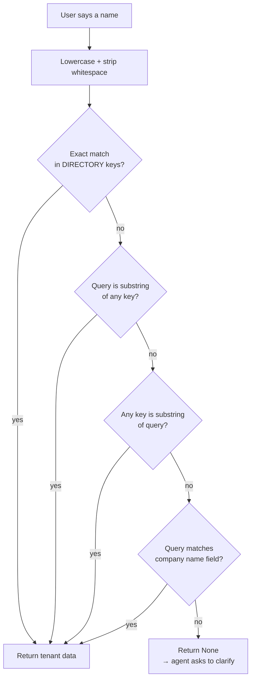

---

## Conversation State Machine

Unlike the psychology assessor (which has formal states), the receptionist follows an implicit flow:

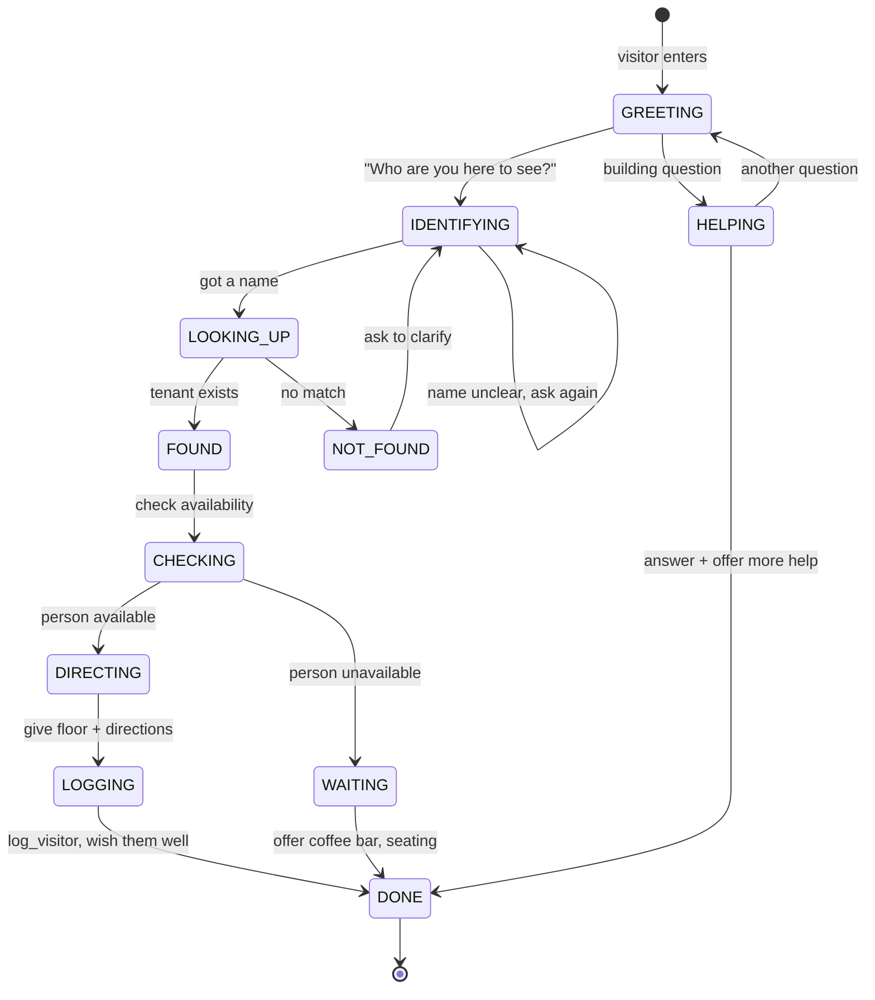

---

## Capabilities — Pluggable Pipeline Modules

> **For AI tools:** Capabilities are NOT tools. They are pipeline plugins that process audio/text automatically on every turn and inject context for the LLM. Tools are called on demand by the LLM. Capabilities run whether the LLM asks for them or not.

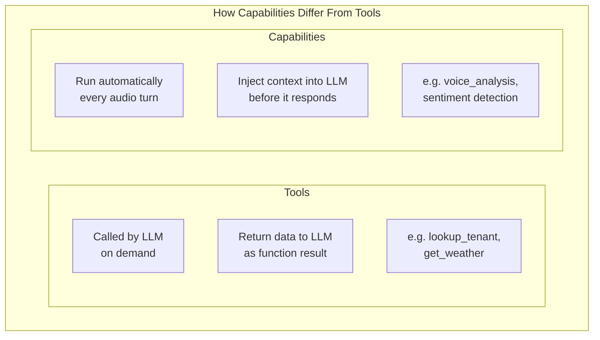

### Voice Analysis Capability — How It Works

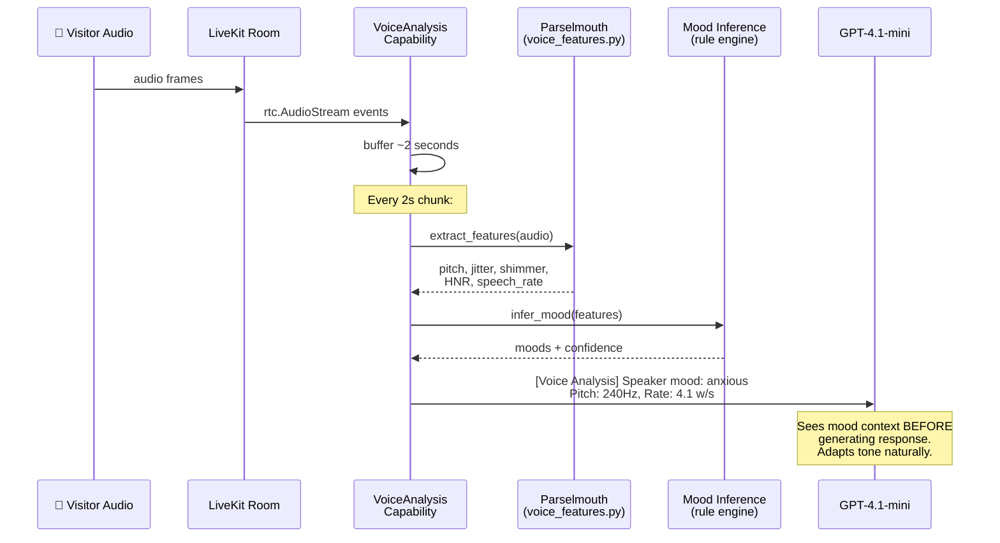

### Mood Inference Rules

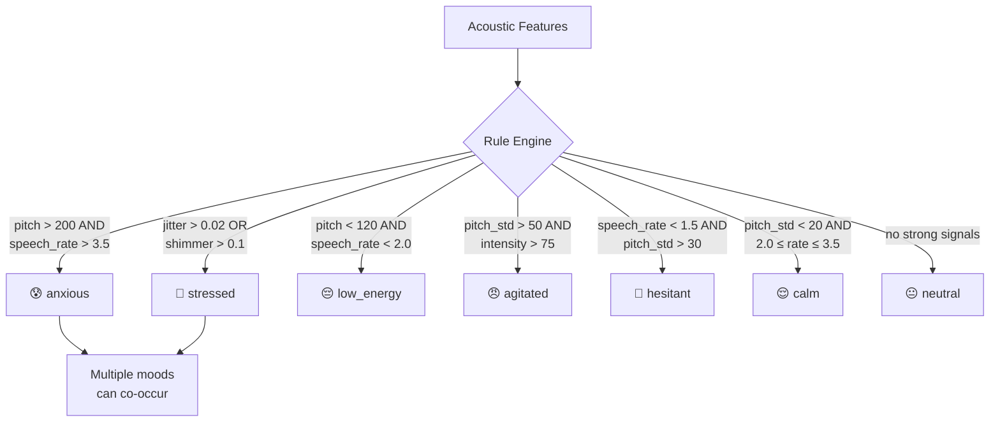

### Capability Architecture — Adding / Removing

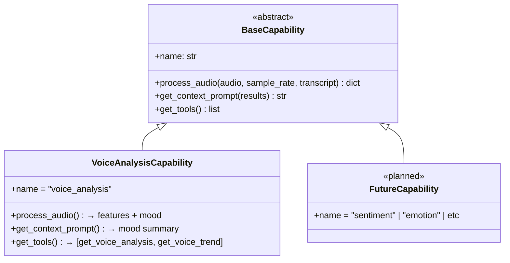

### Per-Persona Capability Configuration

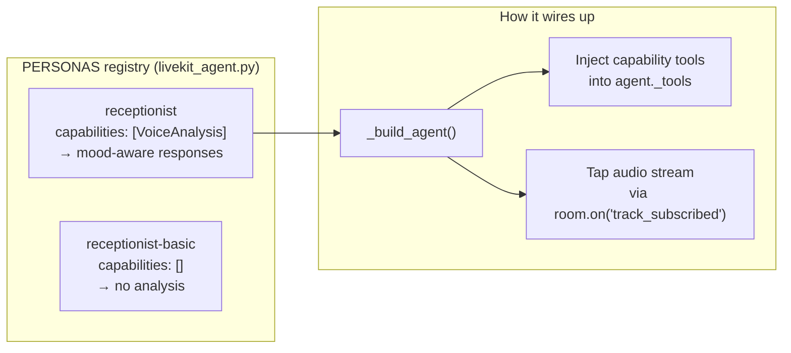

Adding voice analysis to any persona = one line change:

```python
PERSONAS = {
    "my_persona": {
        "agent_class": MyAgent,
        "capabilities": [VoiceAnalysisCapability],  # ← add here
        # ...
    },
}
```

Removing = delete the entry from the list. No code changes in the persona itself.

### How the Receptionist Uses Voice Analysis

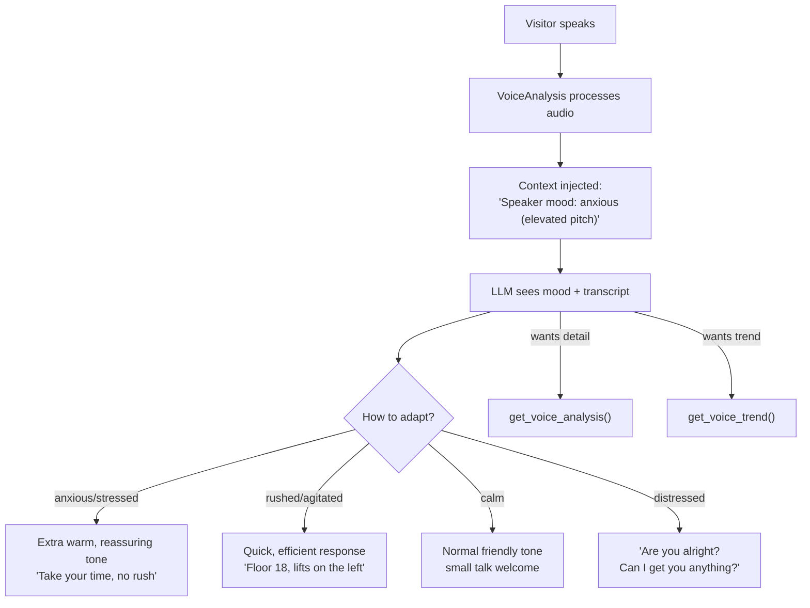

The LLM NEVER tells the visitor it's analyzing their voice. It just adapts — like a good receptionist who reads the room.

---

## File Map — Where Everything Lives

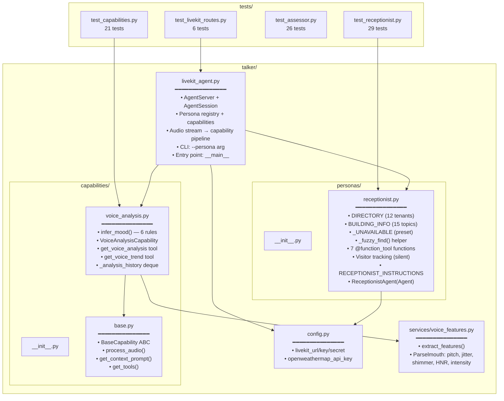

---

## How to Add a New Tool

> **For AI tools:** Follow this pattern exactly when adding tools to any persona.

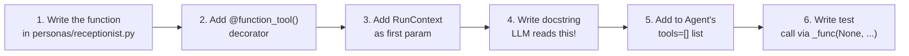

**Template:**

```python
@function_tool()
async def my_new_tool(
    context: RunContext,
    param_name: str,
) -> dict[str, Any]:
    """One-line description the LLM will see.

    Args:
        param_name: What this parameter means.
    """
    # Business logic here — no framework coupling
    return {"key": "value"}
```

**Then add to the agent:**

```python
class ReceptionistAgent(Agent):
    def __init__(self) -> None:
        super().__init__(
            instructions=RECEPTIONIST_INSTRUCTIONS,
            tools=[
                lookup_tenant,
                check_availability,
                get_building_info,
                get_weather,
                log_visitor,
                recognize_visitor,
                register_visitor,
                my_new_tool,  # ← add here
            ],
        )
```

---

## How to Add a New Persona

> **For AI tools:** This is the pattern for creating new personas on the platform.

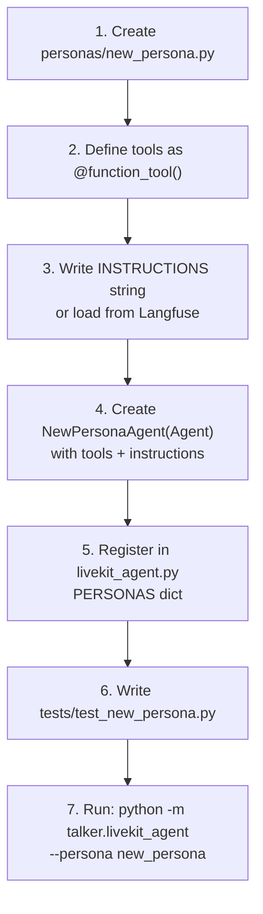

**In `livekit_agent.py`:**

```python
from talker.personas.new_persona import NewPersonaAgent

PERSONAS = {
    "receptionist": ReceptionistAgent,
    "new_persona": NewPersonaAgent,  # ← add here
}
```

---

## Running the Agent

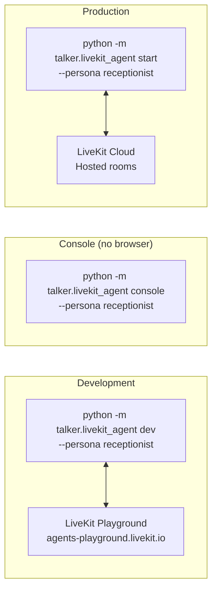

**Required env vars:**

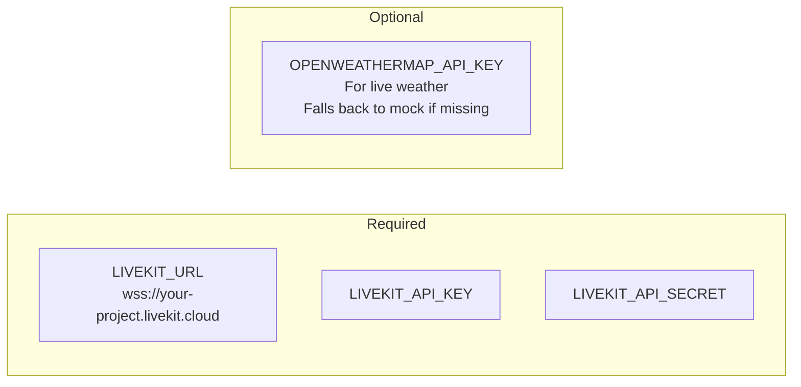

---

## Test Coverage Map

```mermaid
graph TB
    subgraph "test_receptionist.py — 29 tests"
        subgraph "Pure Functions (7)"
            T1["_fuzzy_find exact match"]
            T2["_fuzzy_find by person"]
            T3["_fuzzy_find case insensitive"]
            T4["_fuzzy_find substring"]
            T5["_fuzzy_find company name"]
            T6["_fuzzy_find not found"]
            T7["_fuzzy_find whitespace"]
        end

        subgraph "Tool Functions (15)"
            T8["lookup_tenant found"]
            T9["lookup_tenant not found"]
            T10["lookup_tenant fuzzy"]
            T11["check_availability unavailable"]
            T12["check_availability meeting"]
            T13["building_info bathroom"]
            T14["building_info parking"]
            T15["building_info restaurant"]
            T16["building_info unknown"]
            T17["weather fallback"]
            T18["visitor log"]
            T18b["visitor log untracked"]
            T18c["recognize visitor (no db)"]
            T18d["recognize visitor (no params)"]
            T18e["register visitor (no db)"]
        end

        subgraph "Agent + Data (7)"
            T19["instantiation"]
            T20["has instructions"]
            T21["has 7 tools"]
            T22["6+ unique tenants"]
            T23["all floors positive"]
            T24["essential topics"]
            T25["required fields"]
        end
    end

    subgraph "test_capabilities.py — 21 tests"
        subgraph "Mood Inference (10)"
            M1["neutral / no signals"]
            M2["anxious"]
            M3["stressed"]
            M4["low energy"]
            M5["agitated"]
            M6["hesitant"]
            M7["calm"]
            M8["empty features"]
            M9["confidence scaling"]
            M10["mood co-occurrence"]
        end

        subgraph "Capability Class (7)"
            C1["name property"]
            C2["is BaseCapability"]
            C3["process_audio output"]
            C4["updates history"]
            C5["context prompt format"]
            C6["exposes 2 tools"]
            C7["empty results → no context"]
        end

        subgraph "Voice Tools (4)"
            V1["analysis — no data"]
            V2["analysis — with data"]
            V3["trend — insufficient"]
            V4["trend — with history"]
        end
    end
```

---

## Edge Case Handling

How the agent handles situations that make conversations feel human:

```mermaid
graph TB
    subgraph "Person Not Found"
        NF1["Visitor: 'I'm here to see John Smith'"]
        NF2["lookup_tenant → not found"]
        NF3["Agent: 'I can't find a John Smith.<br/>Do you know which company they're with?'"]
        NF4["Visitor: 'Deloitte'"]
        NF5["lookup_tenant('Deloitte') → found, floor 18"]
        NF1 --> NF2 --> NF3 --> NF4 --> NF5
    end

    subgraph "Person Unavailable"
        UA1["lookup_tenant → found"]
        UA2["check_availability → unavailable:<br/>'in a meeting until 3pm'"]
        UA3["Agent: 'Priya's in a meeting until 3.<br/>There's a coffee bar on the ground floor<br/>if you'd like to wait.'"]
        UA1 --> UA2 --> UA3
    end

    subgraph "Building Question"
        BQ1["Visitor: 'Where's the loo?'"]
        BQ2["get_building_info('toilet') → match"]
        BQ3["Agent: 'Just past the lifts on<br/>the ground floor, to your left.'"]
        BQ1 --> BQ2 --> BQ3
    end

    subgraph "Weather / Small Talk"
        WT1["Visitor: 'Lovely day isn't it?'"]
        WT2["get_weather() → 14°C, partly cloudy"]
        WT3["Agent: 'Not bad for London! 14 degrees<br/>and partly cloudy. The view from<br/>the 72nd floor should be decent today.'"]
        WT1 --> WT2 --> WT3
    end
```
